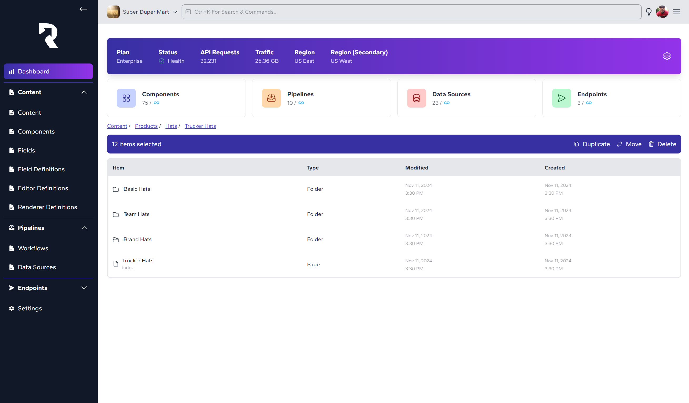
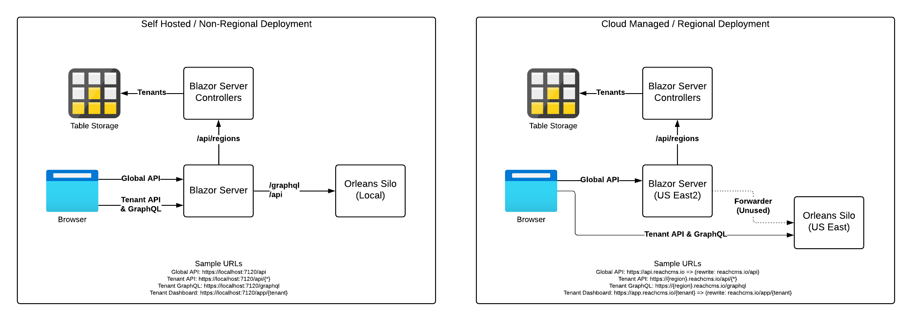

# Reach CMS

Reach is an open source, headless, composable content platform built on .NET/Blazor, Tailwind, Aspire, Microsoft Orleans, Mongo, EventHubs, Azure Storage and other associated technologies. It is an exploration in what a modern content management system would look like on .NET. Easily create and manage content, manage data sources and workflows, and expose data endpoints all from one web application. Develop or install custom applets that extend the ecosystem. Deploy locally or use a cloud hosted option.

> Image is a just a concept of the originally intended design. Actual runtime design may differ.



## Overview

The core platform is built upon .NET and Microsoft Orleans, a framework for building modern distributed applications. Fields, Compnents and Content are exposed by the core platform and managed by Orleans. For example, every piece of Content is represented by an Event Sourced Grain, allowing for significant scalability while maintaining historical/change data.

In addition, the core platform also exposes a framework for developing and using plugins called **Applets**. Three base applets are included out-of-the-box to support content editing, workflow pipelines, and endpoint management.

Instead of employing an opinionated notion of how content and data should be managed in terms of Draft/Publish status and a number of other properties, Reach supports the concept of **Pipelines**. These pipelines may be triggered to update, transform and store information into a concept of **Buckets**.

To provide access to these resulting datasets, **Endpoints** provide the capabilities for exposing basic HTTP endpoints for retrieving and querying data stored in **Buckets**.

## Data Architecture

For more information on how data is maintained in Reach, read the [Data Architecture](./doc/data-architecture.md) documentation.

## Applets

Reach provides the basic building blocks for creating and managing content through a series of out-of-the-box structures. These data sets are managed through a series of Applets, which provide plug-and-play features to the core platform.

### Built-in Applets

The following Applets are included as part of the core platform

* **Content** - The Content Applet supports editing of Pages, Content, Components, Fields and Field Types, providing the basic functionality of creating and maintaining content on the platform.
* **Pipelines** - With Pipelines, users are able to define state machines and workflows for processing data. Whether it is defining how data should be reviewed and published for retrieval by the frontend or ingestion and ETL type workflows, Pipelines supports it all.
* **Endpoints** - Endpoints define how and by whome data is retrieved both internally and externally. In conjunction with Content and Pipelines, Endpoints provides a surface for supporting unique business scenarios.

### Developing an Applet

> **NOTE**: This section is subject to change as the framework develops.

Create a Blazor Component Library that implements the desired functionality. Two components should be created, one as the main editor and one to edit any settings your Applet requires.

Add a class that returns an `AppletDefinition` instance.

Reference this library from the Reach Editor project, and add the applet definition in `HostBuilderExtensions`.

## Routing

Reach uses a number of route variations to handle traffic depending on whether it is running in self-hosted (single region) or cloud hosted (multi-region) mode. The following diagram documents the overall strategy for routing.

The Blazor Server project (`Reach.EditorApp`) maintains a forwarding proxy for any route not matched by a Global API Controller (Tenants, Regions, Account Services). Simultaneously, Region URL Formatters provide routing for each Tenant's API endpoints. In a self-hosted setup, all routing navigates through the forwarding proxy.



### Self Hosted URLs

For this example, we will host using the Aspire app on a local machine.

| Description | URL |
| --- | --- |
| Global API | localhost:7120/api |
| Tenant API | localhost:7120/api/* |
| Tenant GraphQL | localhost:7120/graphql |
| Tenant Dashboard | localhost:7120/app/{tenantSlug} |
| Content App | localhost:7120/app/{tenantSlug}/content |

### Cloud Hosted URLs

For this example, we will use the reachcms.io hosting platform. Note that in the case of Region based routing, the API and GraphQL requests for each tenant are sent directly to the Orleans cluster for performance.

| Description | URL |
| --- | --- |
| Global API | reachcms.io/api |
| Tenant API | {regionKey}.reachcms.io/api/* |
| Tenant GraphQL | {regionKey}.reachcms.io/graphql |
| Tenant Dashboard | reachcms.io/app/{tenantSlug} |
| Content App | reachcms.io/app/{tenantSlug}/content |

## Authentication

> **NOTE**: This section is subject to change as the framework develops.

Reach currently relies on Auth0 authentication, but this is configurable from the `EditorApp` and `Reach.Silo.Host` projects.

Create a tenant in Auth0, a Website Application, and an API Application. In the Editor's User Secrets or in `appsettings.json`, add the following configuration, substituting your Auth0 configuration.

```json
{
    // ... other configuration
    "Auth0": 
    {
        "Domain": "<AUTH0 DOMAIN>",
        "ClientId": "<WEBSITE APP CLIENT ID>",
        "ClientSecret": "<API APP SECRET>",
        "Audience": "<API AUDIENCE>"
    }
}
```

## Deploying

TBD.